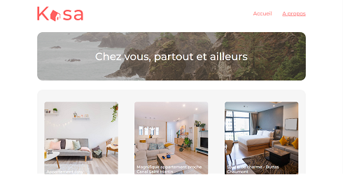

# Kasa - Openclassrooms

## Description

Projet Openclassrooms: création d'un site d'agence immobilière avec React. Intégration d'une maquette figma à l'aide de SCSS avec la méthode BEM.  
Utilisation des hooks standards et d'un hook custom. Animation d'un carrousel et d'un collapse.

**Tags**: *Intégration, React-router-dom, Hooks, SCSS, BEM*

<p align="center">
  
</p>

## Installation

```
npm install
```

Afin d'installer toutes les librairies

```
npm run start
```

Pour lancer le serveur